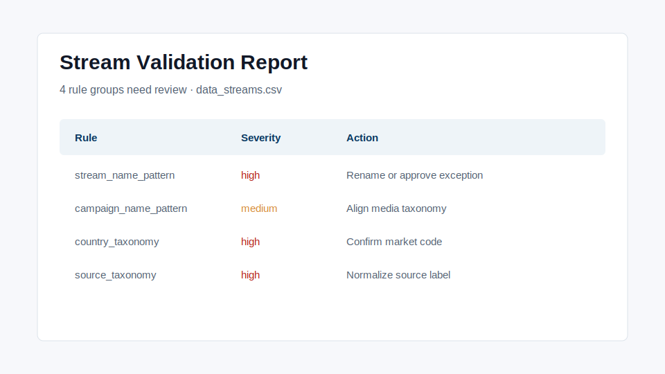

# Datorama Data Stream Naming Validator

A practical naming-governance validator for Salesforce Marketing Cloud Intelligence / Datorama-style data stream operations.

The project validates stream names, source labels, market/category fields and campaign naming before bad taxonomy reaches dashboards.

## Problem

Datorama dashboard operations become harder when teams use inconsistent stream names, campaign labels, source fields or country/category values. The damage usually appears later as broken filters, duplicate dimensions, unclear ownership and unreliable dashboard grouping.

## What It Does

Run the validator:

```bash
python scripts/validate_streams.py \
  --input sample_data/data_streams.csv \
  --rules config/naming_rules.yml \
  --out reports/sample_validation_report.md
```

The output is a Markdown QA report with failed rules, severity and suggested fixes.

## Business Value

This repo shows a practical governance workflow:

- validate data stream naming before dashboard refreshes
- reduce inconsistent country, category and source fields
- make naming exceptions visible
- give vendors and agencies a clear rulebook
- attach QA evidence to delivery tickets

## Tech Stack

- Python
- pandas
- PyYAML
- Markdown reports
- pytest

## Screenshots



## Why This Matters

Dashboard governance is not only about the dashboard UI. It starts with boring fields that decide whether filters, joins, blends and stakeholder views behave correctly. This project makes that operational layer visible.

## What I Would Improve Next

- Add market-specific exception files.
- Add GitHub Actions scheduled validation.
- Export Excel QA summaries for vendors.
- Add Streamlit UI for uploading stream inventories.

## License

MIT
